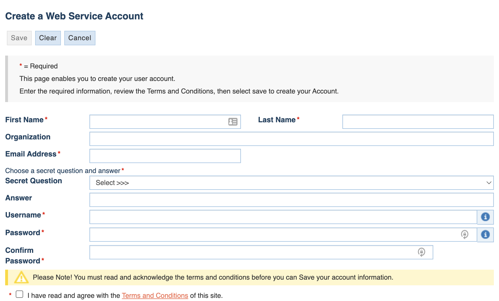

FFIEC Account Setup Instructions
==================

Prerequisites for ffiec_data_connect package
------------------------------------------

The `ffiec_data_connect` package supports two authentication methods:

**1. SOAP API (Legacy)**
To utilize the SOAP API, you must create an account with the Federal Financial Institution Examination Council (FFIEC)'s Webservice portal.

There is no cost for the account, nor are there any apparent maximum limits for the total amount of data downloaded. Users are advised to read the terms of service and privacy policy before applying for a user name and utilizing the service.

However, there are unpublished rate limits. When utilizing the package, it is recommended to utilize retry logic, in the event
that the rate limit is exceeded.

Please note that support for use of the FFIEC accounts is provided by the FFIEC, and is not provided by the `ffiec_data_connect` package repository.

How to create an account
-------------

1. Visit the website at https://cdr.ffiec.gov/public/PWS/CreateAccount.aspx?PWS=true
2. Complete the fields requested
3. Receive an email with a link to activate your account
4. Start using the `ffiec_data_connect` package with WebserviceCredentials!

**2. REST API (Modern)**

For the REST API, you'll need OAuth2 credentials:

1. Obtain a bearer token from the FFIEC REST API authentication endpoint
2. Use OAuth2Credentials with your username and bearer token
3. The REST API offers improved performance and reliability over SOAP

Example REST credential setup::

    from ffiec_data_connect import OAuth2Credentials
    from datetime import datetime, timedelta
    
    creds = OAuth2Credentials(
        username="your_username",
        bearer_token="your_bearer_token",
        token_expires=datetime.now() + timedelta(days=90)
    )

