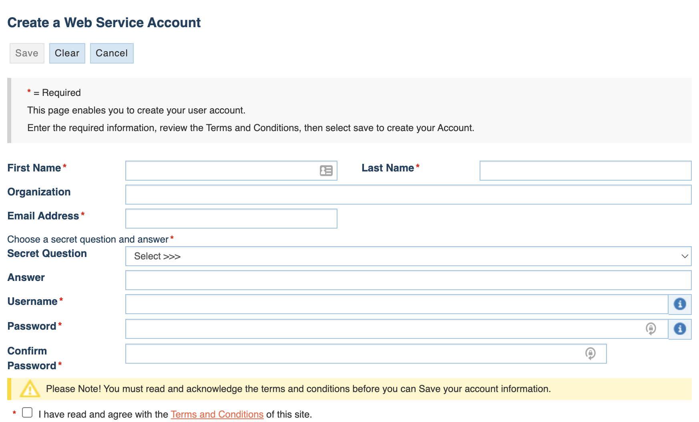

FFIEC Account Setup Instructions
=================================

Prerequisites for ffiec_data_connect package
---------------------------------------------

The `ffiec_data_connect` package uses the FFIEC REST API with JSON Web Token (JWT) authentication:

* JWT tokens begin with ``ey`` and end with ``.``
* Token expiration is auto-detected from the JWT payload
* The token is NOT your account password - it must be generated separately
* REST API specifications available at: ``https://cdr.ffiec.gov/public/Files/SIS611_-_Retrieve_Public_Data_via_Web_Service.pdf``

Account Creation and Setup
--------------------------

New Users
~~~~~~~~~

1. **Create FFIEC Account**

   .. note::
      **No separate Microsoft account required!** The FFIEC registration process will create the
      necessary Microsoft Entra ID authentication for you.

   - Visit: https://cdr.ffiec.gov/public/PWS/CreateAccount.aspx?PWS=true
   - Complete the registration fields
   - You'll receive an invitation email from ``invites@microsoft.com``
   - Accept the invitation and complete the Microsoft Entra ID registration process

   .. warning::
      **Callback Link Issues**

      After completing Microsoft verification, the callback link may not work properly.
      If you encounter an error or blank page, manually navigate to:
      https://cdr.ffiec.gov/public/PWS/PublicLogin.aspx

2. **Generate JWT Token**

   - Log into your CDR PWS account at https://cdr.ffiec.gov/public/PWS/PublicLogin.aspx
   - Navigate to token generation section
   - Generate a new JWT token (valid for 90 days)
   - **Important**: The JWT token is what you use in the API, NOT your login password

Using Credentials in Code
-------------------------

.. code-block:: python

    from ffiec_data_connect import OAuth2Credentials

    # JWT tokens start with 'ey' and end with '.'
    # Example: eyJhbGciOiJub25lIiwidHlwIjoiSldUIn0...YXVkIjoiUFdTIFVzZXIifQ.

    # token_expires is auto-detected from the JWT payload.
    # You only need to supply username and bearer_token.
    creds = OAuth2Credentials(
        username="your_username",  # Your CDR account username
        bearer_token="eyJhbGci...",  # JWT token from CDR PWS portal (NOT your password!)
    )

    # Collect data using the new calling convention
    import ffiec_data_connect as fdc

    data = fdc.collect_data(
        creds,
        rssd_id="37",
        reporting_period="2024-09-30",
        series="call"
    )

Important Notes
---------------

.. caution::
   **Common Authentication Mistakes**

   1. **Using password instead of JWT token**: The REST API requires the JWT token generated from the portal, NOT your account password
   2. **Token expiration**: JWT tokens expire after 90 days - set up reminders to regenerate
   3. **Token format**: Valid JWT tokens always start with ``ey`` and end with ``.``

**Token Management Best Practices**

- Store tokens securely (use environment variables or secret management systems)
- Never commit tokens to version control
- Implement token refresh logic before expiration
- Monitor token expiration dates in production systems

**Additional Resources**

- What's New: https://cdr.ffiec.gov/public/HelpFileContainers/WhatsNew.aspx
- FAQs: https://cdr.ffiec.gov/public/HelpFileContainers/FAQ.aspx
- Help Desk: cdr.help@cdr.ffiec.gov
- Official REST API Specifications (PDF): ``https://cdr.ffiec.gov/public/Files/SIS611_-_Retrieve_Public_Data_via_Web_Service.pdf``
- **Reverse-Engineered OpenAPI Schema**: :doc:`rest_api_reference` (see our unofficial but validated OpenAPI specification)

.. tip::
   **REST API Documentation**

   While the official FFIEC documentation provides the authoritative reference, we've created a
   reverse-engineered OpenAPI specification based on extensive testing. This specification:

   - Documents actual API behavior including quirks and non-standard patterns
   - Provides complete request/response schemas
   - Available at: :doc:`rest_api_reference`
   - Raw YAML file: ``docs/ffiec_rest_api_openapi.yaml`` in the repository

